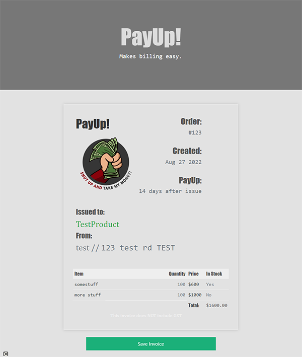

  
  # PayUp!
  
  ## Table of Contents
  * [Description](#description)
  * [Installation](#installation)
  * [Usage](#usage)
  * [Contributing](#contributing)
  * [Guidelines](#guidelines)
  * [Tests](#tests)
  * [License](#license)
  * [Questions](#questions)
---

  ## Description
  PayUp! is an app designed to allow users to quickly and simply generate an invoice for their business to issue to a client, using a straight forward and easy to understand interface. Upon opening the app the user will be asked to either login or create an account, upon which they will be redirected to a simple page that consists of a form to enter a product and its details, and a column that lists the previous products for the current order. Once the user has added all the desired products, they simply click on a button to generate a stylish formatted invoice with the details of their business, the client and all the products being supplied along with the total cost of all products, which can then be saved as a pdf to either print or send to the client. This app creates an abridged invoice that is non inclusive of GST and not associated with tax in any way.

 

  ## Installation
   None

  ## Usage
   Visit http://payup-invoice-gen.herokuapp.com

  ## Contributing
   If you'd like to contribute, reach out to one of the collaborators via their GitHub page.

  ## Guidelines
   As stated above, the invoice generated by this app is not inclusive of GST and gives an approximation of a service prior to tax - while this may be implemented in the future if you are in need of a tax invoice inclusive of GST this is not the appropriate app.

  ## Tests
  
  ---

  ## License
   Licensed under [MIT](https://opensource.org/licenses/MIT) 

   ---

  ## Questions
   For any questions reach out to one of the collaborators via their GitHub page.
   
   * [Matt Leftwich](https://github.com/mleftwich)
   * [Jake Roberts](https://github.com/JRoberts94)
   * [Navneet Birdi](https://github.com/Navneet-Birdi)
